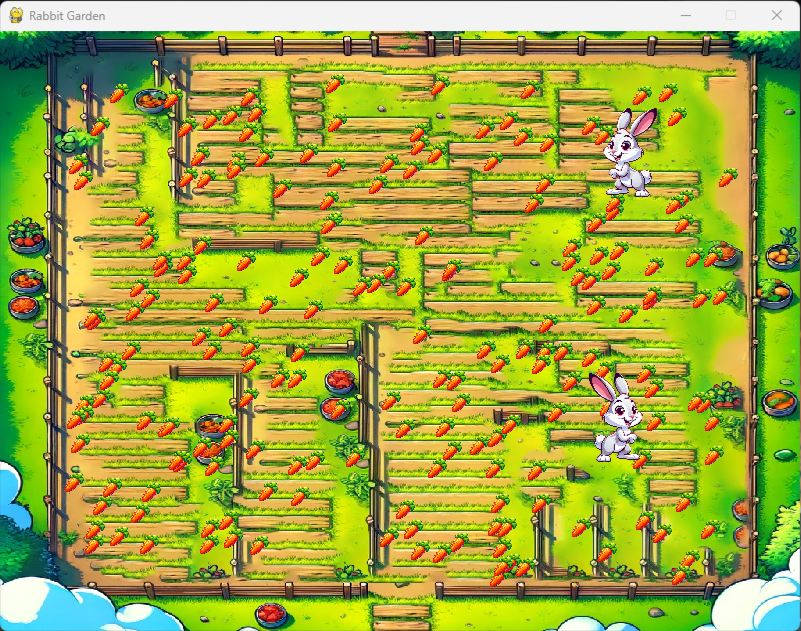

## Rabbit and Carrot Population Simulation

Welcome to our Rabbit and Carrot population simulation project. This project was developed as part of a school project by a group of students.



# Overview
In this project, we have created a simulation of a garden where rabbits and carrots interact. Rabbits can live up to 4 years if they don't die of hunger and up to 6 years if well-fed by eating every week. Rabbits can reproduce from the age of 1 year if they have a partner. Carrots are sown in March and give birth to two litters of a maximum of 6 little carrots each, one in April and the other in July. The evolution of populations is programmed using Python.

# Features
- Simulation of rabbit and carrot populations in a garden.
- Management of the life, reproduction, and hunger of rabbits.
- Growth and harvest of carrots.
- Graphical interface created using Pygame.

# Installation
To run the project on your own machine, follow these installation steps:
1. Clone this GitHub repository:
```bash
git clone https://github.com/AzFyXi/pythonRabbitGame.git
```
2. Install the required dependencies:
```bash
pip install -r requirements.txt
```
3. Run the game (please note that it's not playable, it's a simulation):
```bash
python3 main.py
```

# Usage
Once the game is running, you will see the population of rabbits and carrots evolving in the garden. You can't interact with the simulation.

# Contribution
This project is the result of a collaborative endeavor by AzFyXi, rems08, Florian-cop, Zazou0 and violetow9 for school
